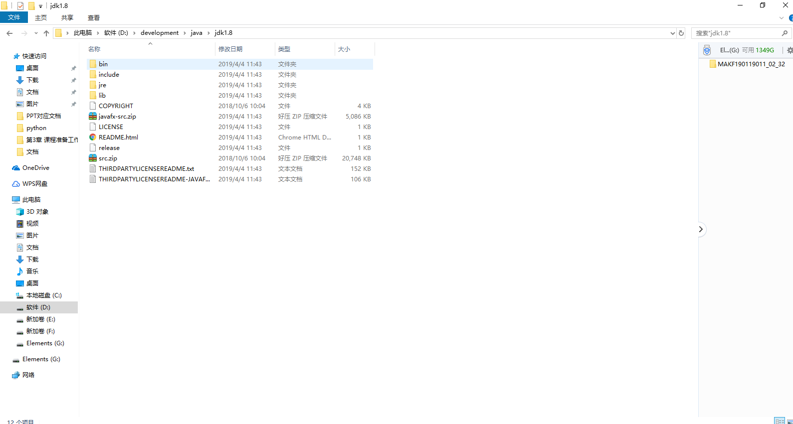
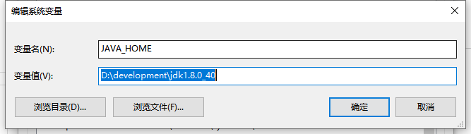
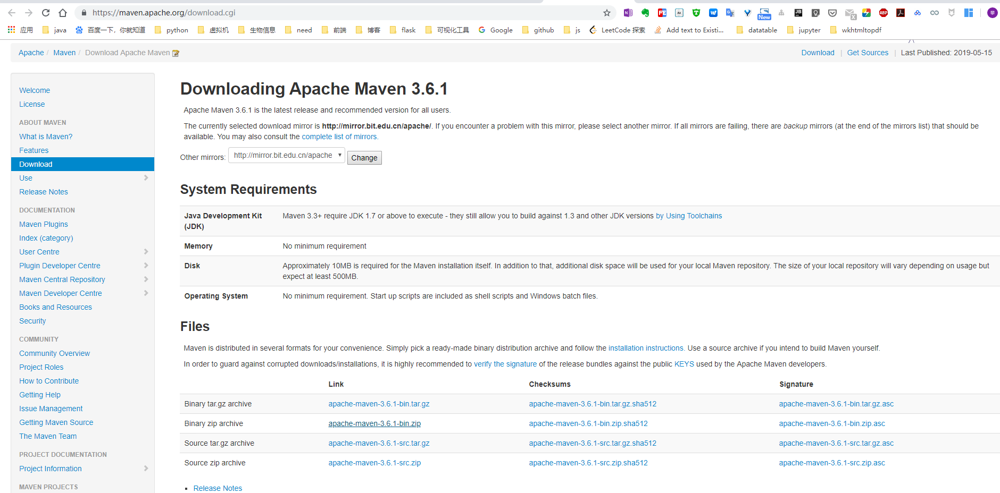
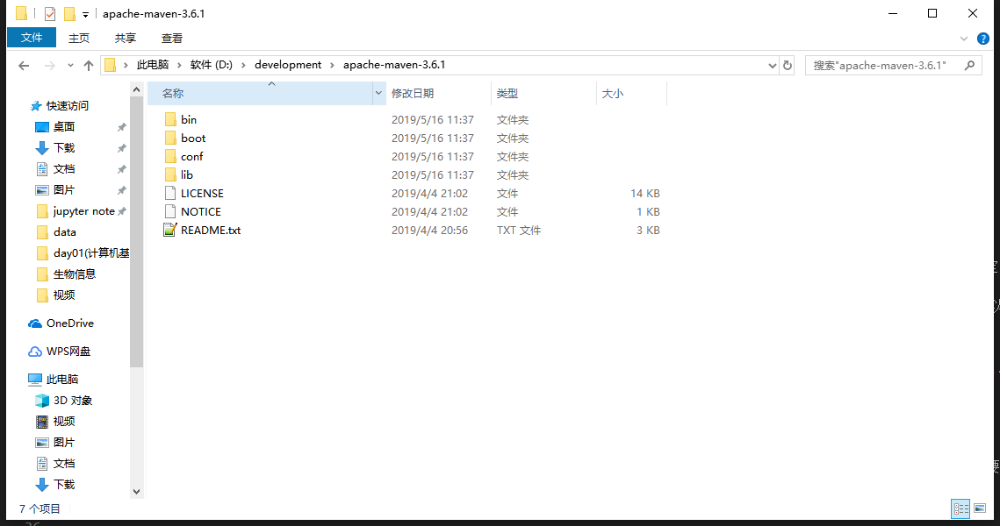
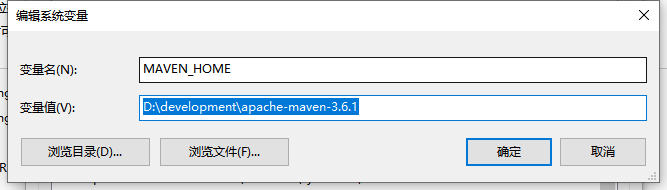

===========================================
Java 下载与安装
===========================================

如何由jdk的安装版本改成非安装版本
==========================================

1. 创建一个目录命名为jdk8，名称位置随意。
#. 点击jdk-8u191-windows-x64.exe，选择路径为jdk8，继续。
#. 在选择安装路径的时候选择取消，此时免安装版本的文件已经存在于jdk8中。文件目录如下：|image1|

配置JAVA环境变量
====================================

系统变量——新建——变量名“JAVA_HOME”，变量值“Java的安装路径” |image2|
PS:Path环境变量的值就是一个可执行文件路径的列表，当执行一个可执行文件时，系统首先在当前路径下寻找，如果找不到，则到Path中制定的各个路径下去寻找，直到找到为止，若Path下也找不到，会报错。
Java的编译器（javac.exe）和解释器（java.exe）都在安装路径下的bin目录中。为了在任何路径下都可以使用他们编译执行Java程序，所以应该将它们所在的路径添加到Path变量中。

CLASSPATH环境变量指定了Java程序编译或运行时所用到的类的搜索列表。Java的虚拟机查找类的过程不同于Windows查找可执行命令（.exe,.bat或.cmd以及.dll动态链接库）的过程。它不在当前路径下寻找，所以在设定环境变量CLASSPATH时一定要将当前的路径包含进来。
系统变量——新建——变量名“CLASSPATH”，变量值为“.;%JAVA_HOME%\dt.jar;%JAVA_HOME%\lib\tools.jar;”
“.”代表当前路径，表示让Java虚拟机先到当前路径（Java虚拟机运行时的当前工作目录）下去寻找要使用得类； 
 
JAVA_HOME的值就是JDK的安装路径，单独声明一个这样的值，是为了可以如果JDK路径发生变化时，只需要修改JAVA_HOME的值就可以，不需要每处配置都修改，这也是为什么JAVA_HOME可以不配置的原因。
当需要使用到JDK的路径时，可以采用"%JAVA_HOME%"的方式引用。

配置MAVEN环境变量
====================================

**下载**

前往https://maven.apache.org/download.cgi下载最新版的Maven程序|image3|

**将文件解压到目录

|image4|

**新建环境变量**
MAVEN_HOME;D:/\development/\apache-maven-3.6.1
|image5|

**编辑环境变量**
Path,追加%MAVEN_HOME%/\bin

**检查maven是否安装成功**

::

 mvn -v

配置MAVEN本地仓库
===============================

maven\conf\settings.xml文件

::

 <localRepository>/path/to/local/repo</localRepository>
