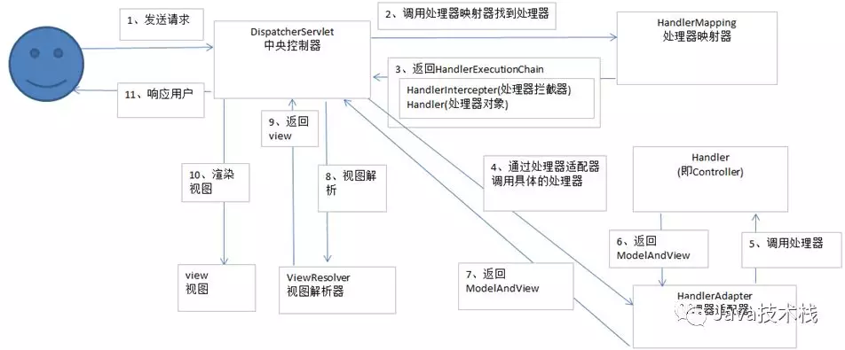
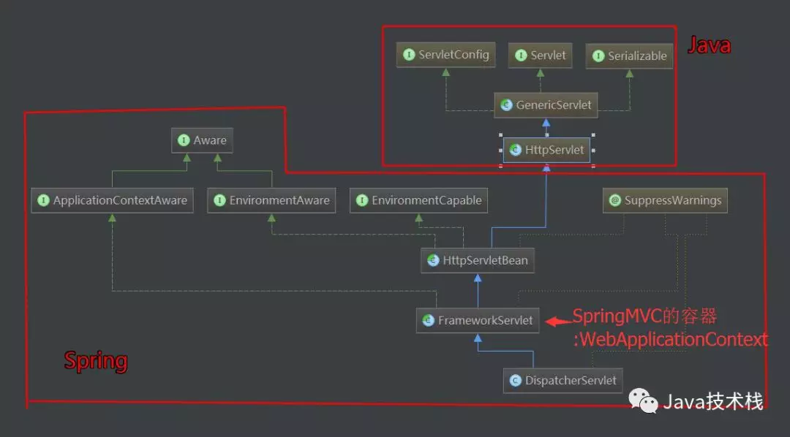

===========================================
1、手写Spring MVC框架
===========================================

一、了解SpringMVC运行流程及九大组件
==================================================

1、SpringMVC的运行流程
>>>>>>>>>>>>>>>>>>>>>>>>>>>>>

|image1|

1. 用户发送请求到前端控制器DispatcherServlet
#. DispatcherServlet收到请求调用HandlerMapping处理器。
#. 处理器映射器根据url找到具体处理器，生成处理器对象及处理器拦截器（如果有则生成）一并返回给DIspatcherServlet
#. DIspatcherServlet通过HandlerAdapter处理器适配器调用处理器
#. 执行处理器（Controller，也叫后端控制器）
#. Controller执行完成返回ModelAndView
#. HandlerAdapter将controller执行结果ModelAndView返回给DispatcherServlet
#. DispatcherServlet 将ModelAndView传给ViewReslover视图解析器
#. ViewReslover解析后返回具体View
#. DispatcherServlet 将对View进行渲染视图（即将模型数据填充至视图中）
#. DispatcherServlet响应用户

**从上面可以看出，DispatcherServlet有接收请求，响应结果，转发等作用。有了DispatcherServlet之后，可以减少组件间的耦合度**

2、SpringMVC的九大组件
>>>>>>>>>>>>>>>>>>>>>>>>>>>>>>>>>>>>>

::

 protected void initStrategies(ApplicationContext context){

    // 用于处理上传请求，处理方法是将普通的request包装成MultipartHttpServletRequest,后者可以直接调用getFile方法获取File
    initMultiparResolver(context);

    //SpringMVC主要有两个地方用到了Locale：一是ViewResolver视图解析的时候，二是用到国际化资源或者主题的时候
    initLocaleResolver(context);

    // 用于解析主题，SpringMVC中一个主题对应一个properties文件，里面存放着跟当前主题相关的所有资源。
    //如图片、css样式等。SpringMVC的主题也支持国际化
    initThemeResolver(context);

    // 用来查找Handler
    initHandlerMappings(context);

    // 适配器，Servlet需要的处理方法的结构却是固定的，都是以request和response为参数的方法
    // 如何让固定的Servlet处理方法调用灵活的Handler来进行处理？这是HandlerAdapter要做的事
    initHandlerAdapters(context);

    // 异常处理
    initHandlerExceptionResolvers(context);
    
    // 有的Handler处理完后并没有设置View也没有设置ViewName，这时就需要从request获取ViewName了，
    //如何从request中获取ViewName就是RequestToViewNameTranslator要做的事情了。
    initRequestToViewNameTranslator(context);

    // ViewResolver用来将String类型的视图名和Locale解析为View类型的视图。
    //View是用来渲染页面的，也就是将程序返回的参数填入模板里，生成html（也可能是其它类型）文件。
    initViewResolvers(context);

    //用来管理FlashMap的，FlashMap主要用在redirect重定向中传递参数。
    initFlashMapManager(context); 

 }

二、梳理SpringMVC的设计思路
===========================================

1、读取配置
>>>>>>>>>>>>>>>>>>>>>

|image2|

从图可以看出，SpringMVC本质上是一个Servlet，这个Servlet继承自HttpServlet。FrameworkServlet负责初始化SpringMVC的容器，并将Spring容器设置为父容器。

为了读取web.xml中的配置，用到ServletConfig这个类，他代表当前Servlet在web.xml中的配置信息。通过web.xml中加载自己写的MyDispatcherServlet和读取配置文件。

2、初始化阶段
>>>>>>>>>>>>>>>>>>>>>>>>>>>>>>>>>

实现：

- 加载配置文件
- 扫码用户配置包下面的所有类
- 拿到扫描到的类，通过反射机质，实例化。并放到ioc容器中（Map的键值对beanName-bean）beanName默认是首字母小写
- 初始化HandlerMapping，这里其实就是把url和method对应起来放在一个k-v的Map中，在运行阶段取出

3、运行阶段
>>>>>>>>>>>>>>>>>>>>>

每次请求将会调用doGet 或doPost方法，所以统一运行阶段都放在doDispatch方法里处理，它会根据url请求去HandlerMapping中匹配对应的Method，然后利用反射机制调用Controller中对应的方法，并得到结果返回。包括以下功能：

- 异常拦截
- 获取请求传入的参数并处理参数
- 通过初始化好的handlerMapping中拿出url对应的方法名，反射调用。

3、实现自己的SpringMVC框架
==================================================

工程及目录结构：

|image3|

参考文档
===========

微信公众号：`好好学java <https://mp.weixin.qq.com/s/Nq_-8OFyQfe1ysNa6g3n6g>` _ 

.. |image3| image:: ./image/