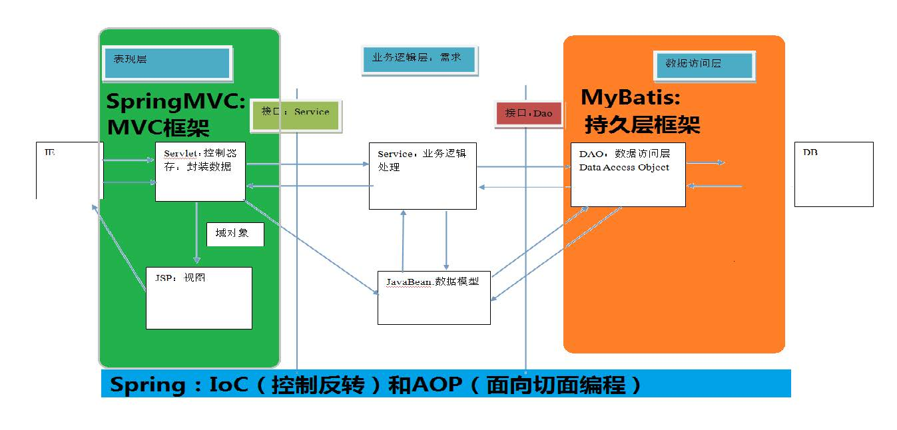

=================
SpringMVC基础
=================

关于三层架构和 MVC
==========================

三层架构
>>>>>>>>>>>>>>>>>>>

- 开发架构一般都是基于两种形式: C/S架构、B/S架构 
- B/S架构一般包括: 表现层、业务层、持久层

- 表现层
    - 常称为web层。负责接收客户端请求,向客户端响应结果,向客户端响应结果，通常客户端使用http协议请求web 层，web 需要接收 http 请求，完成 http 响应。
    - 表现层包括展示层和控制层：控制层负责接收请求，展示层负责结果的展示。
    - 表现层依赖业务层，接收到客户端请求一般会调用业务层进行业务处理，并将处理结果响应给客户端。
    - 表现层的设计一般都使用 MVC 模型。（MVC 是表现层的设计模型，和其他层没有关系）

- 业务层
    - 常称service层。负责业务逻辑处理
    - 业务层在业务处理时可能会依赖持久层，如果要对数据持久化需要保证事务一致性。（也就是我们说的，事务应该放到业务层来控制）

- 持久层
    - 常称Dao层。负责数据持久化,包括数据层即数据库和数据库访问层

1.2、MVC模型
>>>>>>>>>>>>>>>>>>>

MVC全名Model View Controller,是模型(model)视图(view)控制器(controller)的缩写,是一种用于设计创建web应用程序表现层的模式

- Model:
    通常指的是我们的数据模型,作用一般用于封装数据

- View:
    通常指的就是我们的jsp或者html。作用一般是展示数据
    通常视图是根据模型数据创建的

- Controller:
    是应用程序中处理用户交互的部分。作用一般就是处理程序逻辑的。

2、SpringMVC概述
=========================

2.1、Spring是什么
>>>>>>>>>>>>>>>>>>>>>>>

SpringMVC 是一种基于 Java 的实现 MVC 设计模型的请求驱动类型的轻量级 Web 框架

2.2、SpringMVC在三层架构的位置

|image1|

2.3、 SpringMVC的优势
>>>>>>>>>>>>>>>>>>>>>>>>>>>>>

1、清晰的角色划分： 

    - 前端控制器（DispatcherServlet）

    - 请求到处理器映射（HandlerMapping）

    - 处理器适配器（HandlerAdapter） 

    - 视图解析器（ViewResolver） 

    - 处理器或页面控制器（Controller） 

    - 验证器（ Validator） 

    - 命令对象（Command 请求参数绑定到的对象就叫命令对象）

    - 表单对象（Form Object 提供给表单展示和提交到的对象就叫表单对象）。 

2、分工明确，而且扩展点相当灵活，可以很容易扩展，虽然几乎不需要。 

3、由于命令对象就是一个POJO，无需继承框架特定API，可以使用命令对象直接作为业务对象。

4、和Spring 其他框架无缝集成，是其它Web框架所不具备的。 

5、可适配，通过HandlerAdapter可以支持任意的类作为处理器。 

6、可定制性，HandlerMapping、ViewResolver等能够非常简单的定制。 

7、功能强大的数据验证、格式化、绑定机制。 

8、利用Spring提供的Mock对象能够非常简单的进行Web层单元测试。 

9、本地化、主题的解析的支持，使我们更容易进行国际化和主题的切换。 

10、强大的JSP标签库，使JSP编写更容易。 

………………还有比如RESTful风格的支持、简单的文件上传、约定大于配置的契约式编程支持、基于注解的零配置支持等等。

2.4、SpringMVC和Struts2的优略分析 
>>>>>>>>>>>>>>>>>>>>>>>>>>>>>>>>>>>>>>>>>

共同点： 

    - 它们都是表现层框架，都是基于MVC模型编写的。 

    - 它们的底层都离不开原始ServletAPI。 

    - 它们处理请求的机制都是一个核心控制器。 

区别： 

    - Spring MVC 的入口是 Servlet, 而 Struts2 是 Filter 

    - Spring MVC 是基于方法设计的，而Struts2是基于类，Struts2每次执行都会创建一个动作类。所以Spring MVC 会稍微比 Struts2 快些。 

    - Spring MVC 使用更加简洁,同时还支持 JSR303, 处理 ajax 的请求更方便 (JSR303 是一套JavaBean参数校验的标准，它定义了很多常用的校验注解，我们可以直接将这些注解加在我们JavaBean的属性上面，就可以在需要校验的时候进行校验了。) 

    - Struts2 的OGNL 表达式使页面的开发效率相比Spring MVC 更高些，但执行效率并没有比JSTL提升，尤其是struts2的表单标签，远没有html执行效率高。

3、SpringMVC入门案例
=============================

4、SpringMVC执行流程
============================

执行流程图
>>>>>>>>>>>>>>>>>>>>

执行流程
>>>>>>>>>>>>>>>>

1、用户发送请求到前端控制器DispatcherServlet

2、DispatcherServlet收到请求调用HandlerMapping(处理器映射器)

3、HandlerMapping根据url找到HandlerExecution(表示具体的Handler处理器)(根据xml配置、注解进行查找),生成处理器对象及处理器拦截器一并返回给DispatcherServlet

4、DispatcherServlet调用HandlerAdapter(处理器适配器)

5、HanlderAdapter经过适配器调用具体的处理器(Controller,也叫后端控制器)

6、Controller执行完成返回ModelAndView

7、HandlerAdapter将Controller执行结果ModlerAndView返回给DispatcherServlet

8、DispatcherServlet将ModelAndView传给ViewReslover视图解析器

9、ViewReslover解析后返回具体View

10、DispatcherServlet根据View进行渲染视图(即将模型数据填充至视图)

11、DispatcherServlet响应用户

组件说明
>>>>>>>>>>>>>>>>

- DispatcherServlet: 作为**前端控制器**,控制流程的中心,控制其它组件执行,统一调度,降低组件之间的耦合性,提高每个组件的扩展性

- HandlerMapping: 通过扩展**处理器映射器**实现实现不同的映射方式,如:配置文件、实现接口、注解等

- HandlerAdapter: 通过扩展**处理器适配器**,支持更多类型的处理器

- ViewResolver: 通过扩展**视图解析器**,支持更多的视图解析,如: jsp、freemarker、pdf、excel等 

5、请求参数绑定
=================

6、常用注解
==================

@RequestParam
>>>>>>>>>>>>>>>>>>

@RequestBody
>>>>>>>>>>>>>>>>>

@PathVaribale
>>>>>>>>>>>>>>>>>

@RequestHeader
>>>>>>>>>>>>>>>>>

@CookieValue
>>>>>>>>>>>>>>>>>

@ModelAttribute
>>>>>>>>>>>>>>>>>

@SessionAttribute
>>>>>>>>>>>>>>>>>>>>>

响应数据和结果视图
=========================

返回值类型
>>>>>>>>>>>>>>>>>>>

字符串
:::::::::::

