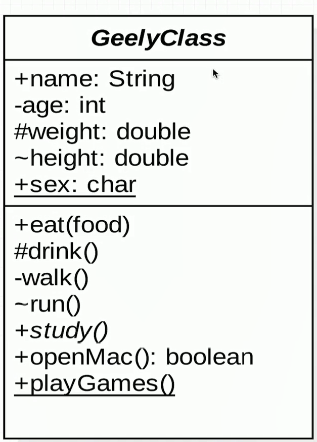
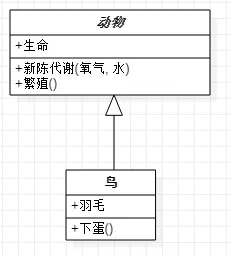
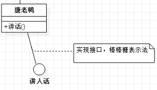
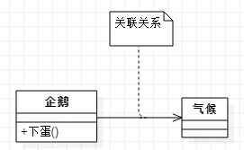
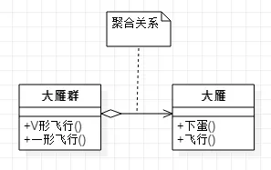
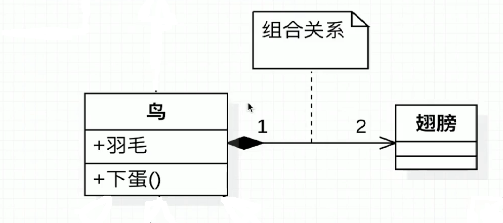

===============
3.UML
===============
UML(Unified Modeling Language 统一建模语言)中描述对象和类之间相互关系的方式包括:依赖(dependency)、关联(Association)、聚合(Aggregation)、组合(Composition)、泛化(Generalization)、实现(Realization)等

1、UML类图(Class Diagram)
==================================

- 依赖(Denpendency): 元素A变化会影响元素B,但反之不成立,那么B和A的关系是依赖关系,B依赖A;类属关系和实现关系在语义上讲也是依赖关系,但由于其有更特殊的用途，所以被单独描述。UML中用带箭头的虚线表示Dependency关系，箭头指向被依赖元素。

- **泛化(Generalization)** : 通常所说的继承(特殊个体is kind of 一般个体)关系。UML中用带空心箭头的实线线表示Generalization关系，箭头指向一般个体。

1.类图基础属性
>>>>>>>>>>>>>>>>>>>>>>>

|image1|

抽象类和抽象方法都使用斜体表示,有抽象方法的类一定是抽象类

.. note:: 

    \+ 表示public访问修饰符

    \- 表示private访问修饰符

    \# 表示protect访问修饰符

    \~ 表示defaut访问修饰符

    横线表示static属性或方法

2.类与类之间关系 [One]_
>>>>>>>>>>>>>>>>>>>>>>>

在UML类图中，常见的有以下几种关系: 泛化（Generalization）, 实现（Realization），关联（Association)，聚合（Aggregation），组合(Composition)，依赖(Dependency)

|image2|

2.1依赖
:::::::::::

介绍：
对于两个相对独立的对象，当一个对象负责构造另一个对象的实例，或者依赖另一个对象的服务时，这两个对象之间主要体现为依赖关系。

表示方法：
依赖关系用虚线箭头表示。

示例：
动物依赖氧气和水。调用新陈代谢方法需要氧气类与水类的实例作为参数

|image6|

2.2泛化
:::::::::::
介绍：
泛化(Generalization)表示类与类之间的继承关系，接口与接口之间的**继承**关系，或类对接口的实现关系

（1）继承

介绍：
继承表示是一个类（称为子类、子接口）继承另外的一个类（称为父类、父接口）的功能，并可以增加它自己的新功能的能力。

表示方法：
继承使用空心三角形+实线表示。(**子类指向父类**)

示例：
鸟类继承抽象类动物

|image3|

（2）实现

介绍：
实现表示一个class类实现interface接口（可以是多个）的功能。
表示方法：

1）矩形表示法
使用空心三角形+虚线表示
比如：大雁需要飞行，就要实现飞()接口

|image4|

2）棒棒糖表示法
使用实线表示

|image5|

2.3关联
:::::::::::

介绍：
对于两个相对独立的对象，当一个对象的实例与另一个对象的一些特定实例存在固定的对应关系时，这两个对象之间为关联关系。

表示方法：
关联关系用实线箭头表示。

示例：
企鹅需要‘知道’气候的变化，需要‘了解’气候规律。当一个类‘知道’另一个类时，可以用关联。

|image7|

2.4聚合
:::::::::::

介绍：
表示一种弱的‘拥有’关系，即has-a的关系，体现的是A对象可以包含B对象，但B对象不是A对象的一部分。 两个对象具有各自的生命周期。

表示方法：
聚合关系用空心的菱形+实线箭头表示。

示例：
每一只大雁都属于一个大雁群，一个大雁群可以有多只大雁。当大雁死去后大雁群并不会消失，两个对象生命周期不同。

|image8|

2.5组合
:::::::::::

介绍：
组合是一种强的‘拥有’关系，是一种contains-a的关系，体现了严格的部分和整体关系，部分和整体的生命周期一样。(具有相同的声明周期)

表示方法：
组合关系用实心的菱形+实线箭头表示，还可以使用连线两端的数字表示某一端有几个实例。

示例：
鸟和翅膀就是组合关系，因为它们是部分和整体的关系，并且翅膀和鸟的生命周期是相同的。

|image9|

链接：https://www.jianshu.com/p/57620b762160

.. |image2| image:: ./img/j03_UML图/UML图.png

.. |image4| image:: ./img/j03_UML图/矩形表示法.webp

.. |image6| image:: ./img/j03_UML图/依赖关系.webp

.. [One] 大话设计模式

2、UML时序图(Sequence Diagram)
======================================

定义：时序图是以时间为序的表示方法，主要用来描述对象之间的时间顺序。将交互关系表示为二维图的。纵轴为时间，横轴为在协作中各个独立的对象。对象存在时用一条虚线表示，当对象的过程处于激活状态是，生命线是一个双道线。消息用从一个对象的生命线到另一个对象生命线的箭头表示。箭头以时间顺序在图中从上到下排列。

时序图中包括的建模元素主要有:
    对象(Actor)、生命线(Lifeline)、控制焦点(Focus of control)、消息(Message)等

