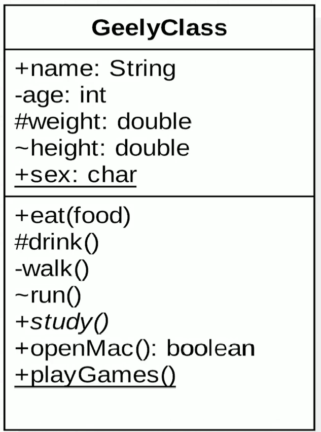
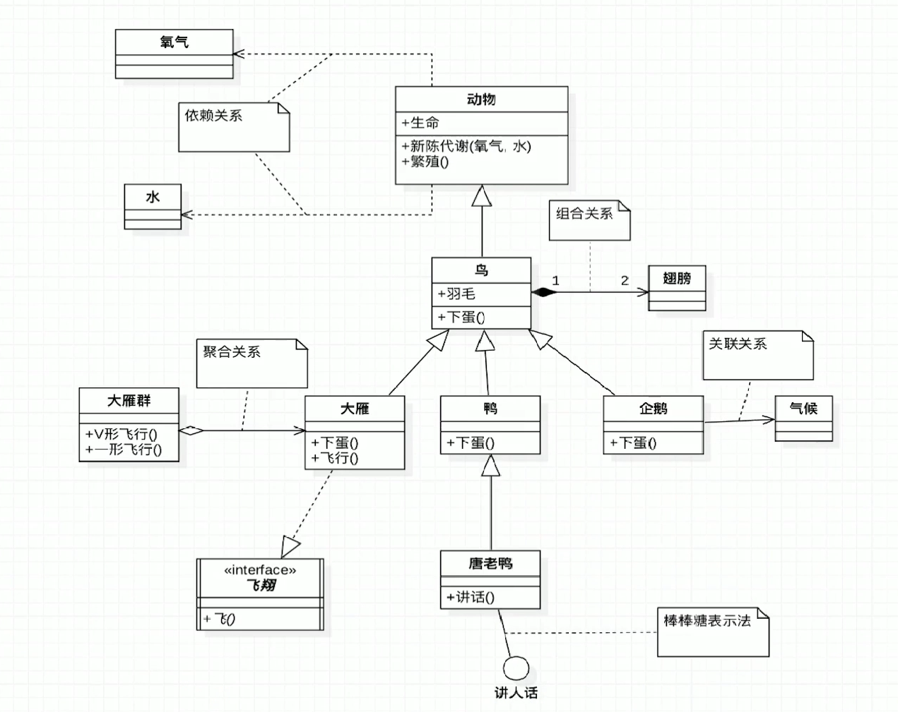

===============
3.UML类图
===============

1.类图基础属性
=======================

|image1|

抽象类和抽象方法都使用斜体表示

.. note:: 

    \+ 表示public访问修饰符

    \- 表示private访问修饰符

    \# 表示protect访问修饰符

    \~ 表示defaut访问修饰符

    横线表示static属性

2.类与类之间关系 [One]_
==========================

在UML类图中，常见的有以下几种关系: 泛化（Generalization）, 实现（Realization），关联（Association)，聚合（Aggregation），组合(Composition)，依赖(Dependency)

|image2|

2.1泛化
>>>>>>>>>>>>>>>>
介绍：
泛化(Generalization)表示类与类之间的继承关系，接口与接口之间的继承关系，或类对接口的实现关系

（1）继承
介绍：
继承表示是一个类（称为子类、子接口）继承另外的一个类（称为父类、父接口）的功能，并可以增加它自己的新功能的能力。
表示方法：
继承使用空心三角形+实线表示。
示例：
鸟类继承抽象类动物

2.2依赖
>>>>>>>>>>>>>>>>>>>>>>

介绍：
对于两个相对独立的对象，当一个对象负责构造另一个对象的实例，或者依赖另一个对象的服务时，这两个对象之间主要体现为依赖关系。

表示方法：
依赖关系用虚线箭头表示。

示例：
动物依赖氧气和水。调用新陈代谢方法需要氧气类与水类的实例作为参数

链接：https://www.jianshu.com/p/57620b762160

.. [One] 大话设计模式

