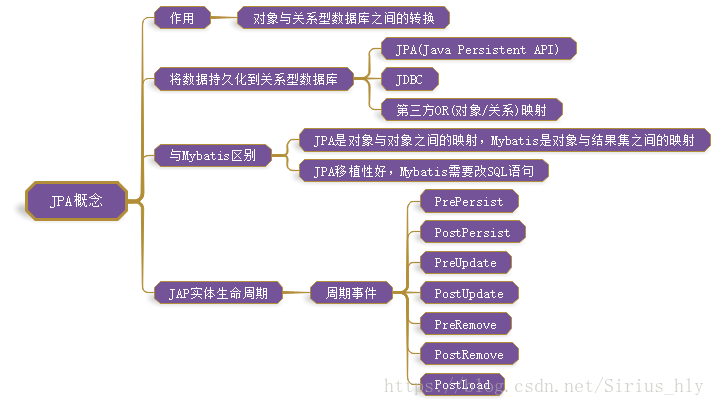

======================================
7、SpringBoot整合Spring Data JPA
======================================

概念
==============
JPA是Java Persistence API的简称，中文名Java持久层API，是JDK 5.0注解或XML描述对象－关系表的映射关系，并将运行期的实体对象持久化到数据库中。

|image1|

JPA核心接口
==================

1、Repositiory接口 [#]_

2、CrudRepository接口 [#]_

3、PagingAndSortingRepository接口 [#]_

4、JpaRepository接口 [#]_

5、JPASpecificationExecutor接口 [#]_

.. [#] Repositiory接口使用

1、提供了方法名称命名查询方式

.. code-block:: JPA是Java
    :linenos:

    package com.zp.dao;

    import com.zp.App;
    import com.zp.pojo.User;
    import org.junit.Test;
    import org.junit.runner.RunWith;
    import org.springframework.beans.factory.annotation.Autowired;
    import org.springframework.boot.test.context.SpringBootTest;
    import org.springframework.test.context.junit4.SpringJUnit4ClassRunner;

    import java.util.List;

    @RunWith(SpringJUnit4ClassRunner.class)
    @SpringBootTest(classes = App.class)
    public class UserRepositoryByNameTest {
        @Autowired
        private UserRepositoryByName userRepositoryByName;

        @Test
        public void testFindByName() {
            List<User> list = userRepositoryByName.findByName("张三");
            System.out.println(list);
        }

        @Test
        public void testFindByNameAndAge() {
            List<User> list = userRepositoryByName.findByNameAndAddress("张三", "湖北");
            System.out.println(list);
        }

        @Test
        public void testFindByNameLike() {
            List<User> list = userRepositoryByName.findByNameLike("%张%");
            System.out.println(list);
        }

        @Test
        public void testFindByNameStartWith() {
            List<User> list = userRepositoryByName.findByNameStartingWith("张");
            System.out.println(list);
        }
    }

.. [#] 2、基于@Query注解查询与更新

.. [#] CrudRepository接口

CrudRepository接口,主要完成一些增删改查的操作,该接口继承Repository接口

.. [#] PagingAndSortingRepository接口使用

.. [#] JpaRepository接口使用

该接口继承了PagingAndSortingRepository接口,对继承的父接口中的方法返回值的适配

.. [#] JPASpecificationExecutor接口使用

该接口主要是提供了多条件查询的支持,并且可以在查询中添加分页和排序。注意：JPASpecificationExecutor是单独存在的,完全独立

