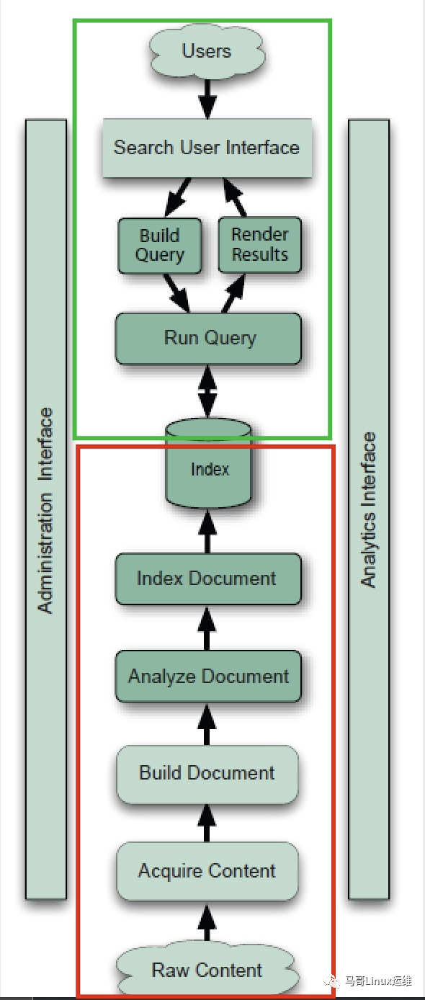

====================
搜索引擎技术原理
====================

搜索引擎（Search Engine）是根据一定的策略、运用特定的计算机程序去搜集信息，在对信息进行组织和处理后，为用户提供检索服务，将用户检索相关的信息展示给用户的一套系统。

|image1|

索引组件为上图中红色框部分

搜索组件为上图中绿色框部分

搜索引擎一般由**索引组件**和**搜索组件**所组成

索引组件
==================

获取数据Acquire Content-->建立文档Build Document-->文档分析Analyze Document-->文档索引(Index Document)

搜索组件
===================

用户搜索接口Search User Interface-->建立查询Build Query（将用户键入的信息转换为可处理的查询对象）-->搜索查询Run Query-->展现结果Render Results

