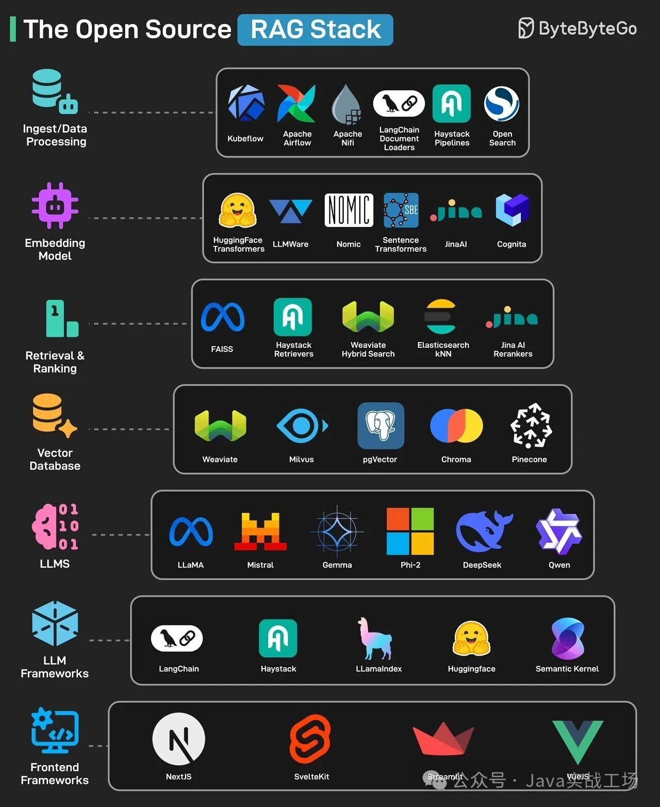

================
RAG技术栈
================

RAG技术栈架构图

|image1|

这张图清晰地展示了开源检索增强生成（RAG）技术栈的完整架构，从上至下依次划分为:

- 数据摄取与处理
- 嵌入模型
- 检索与排序
- 向量数据库
- 大语言模型
- LLM框架
- 前端框架
  
等七个核心层级。 该图来源于网络，由ByteByteGo制作。

