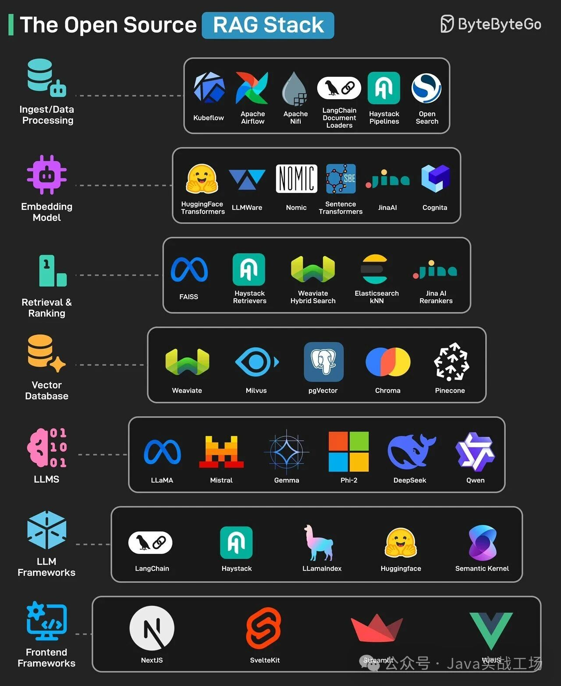

================
RAG技术栈
================

RAG技术栈架构图
-------------------------

|image1|

这张图清晰地展示了开源检索增强生成（RAG）技术栈的完整架构，从上至下依次划分为:

- 数据摄取与处理
- 嵌入模型
- 检索与排序
- 向量数据库
- 大语言模型
- LLM框架
- 前端框架
  
等七个核心层级。 该图来源于网络，由ByteByteGo制作。

大模型角色
----------------

- system: 设定模型的行为和规则
- assistant: 设定模型的回答，由用户设定
- user: 设定模型的输入，由用户设定

.. code-block:: python

  response = client.chat.completions.create(
    model="qwen3.5-plus",
    messages=[
        {"role": "system", "content": "你是一个python开发者，并且不说废话简单回答"},
        {"role": "assistant", "content": "你好,我是编程专家，并且话不多，你要问什么？"},
        {"role": "user", "content": "请输出一个斐波那契数列"}
    ],
  )